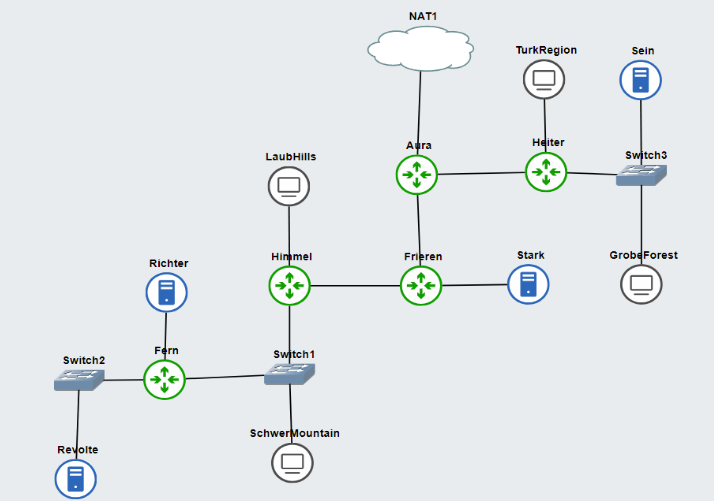
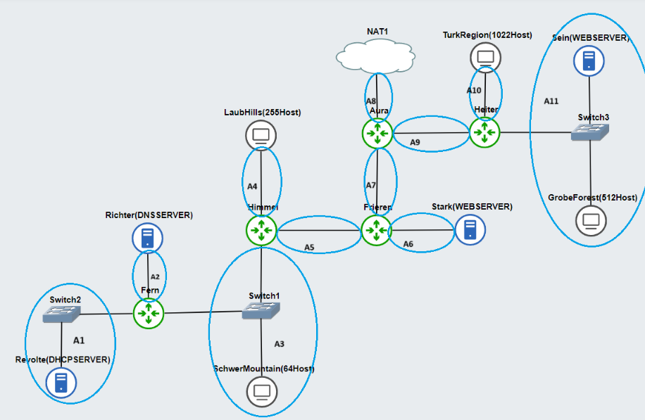
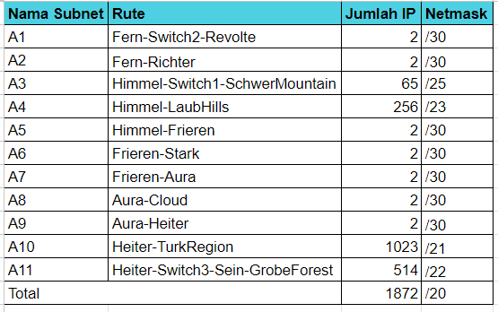
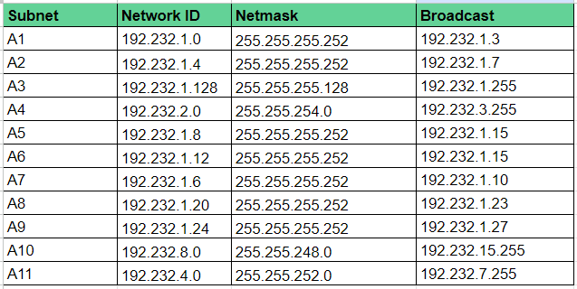

# Jarkom-Modul-5-I08-2023

Nama Anggota | NRP
------------------- | --------------		
Mardhatillah Shevy Ananti | 5025211070
Kirana Alivia Enrico | 5025211190

## List of Contents
- [List of Contents](#List-of-Contents)
- [Task A (Topology)](#topology)
- [Task B (VLSM)](#vlsm)
- [Task C (Routing)](#routing)
- [Task D (DHCP)](#dhcp)
- [Question 1](#question-1)
- [Question 2](#question-2)
- [Question 3](#question-3)
- [Question 4](#question-4)
- [Question 5](#question-5)
- [Question 6](#question-6)
- [Question 7](#question-7)
- [Question 8](#question-8)
- [Question 9](#question-9)
- [Question 10](#question-10)

## Task A (Topology)
> Tugas pertama, buatlah peta wilayah sesuai berikut ini:
>
> 
>
> Keterangan: Richter adalah DNS Server, Revolte adalah DHCP Server, Sein dan Stark adalah Web Server, Jumlah Host pada SchwerMountain adalah 64, Jumlah Host pada LaubHills adalah 255, Jumlah Host pada TurkRegion adalah 1022, Jumlah Host pada GrobeForest adalah 512

### GNS Topology


## NetWork Configuration

- Aura
```
#A8
auto eth0
iface eth0 inet dhcp

#A9
auto eth1
iface eth1 inet static
	address 192.232.1.25
	netmask 255.255.255.252

#A7
auto eth2
iface eth2 inet static
	address 192.232.1.7
	netmask 255.255.255.252

```

- Heiter
```
#A8
auto lo
iface lo inet loopback

#A9
auto eth0
iface eth0 inet static
	address 192.232.1.26
	netmask 255.255.255.252
	gateway 192.232.1.25

#A10
auto eth1
iface eth1 inet static
	address 192.232.8.1	
	netmask 255.255.248.0

#A11
auto eth2
iface eth2 inet static
	address 192.232.4.1
	netmask 255.255.252.0

```

- Frieren
```
auto lo
iface lo inet loopback

#A7
auto eth0
iface eth0 inet static
	address 192.232.1.8
	netmask 255.255.255.252
	gateway 192.232.1.7

#A6
auto eth1
iface eth1 inet static
	address 192.232.1.13
	netmask 255.255.255.252

#A5
auto eth2
iface eth2 inet static
	address 192.232.1.9
	netmask 255.255.255.252

```

- Himmel
```
auto lo
iface lo inet loopback

#A5
auto eth2
iface eth2 inet static
	address 192.232.1.10
	netmask 255.255.255.252
	gateway 192.232.1.9

#A4
auto eth0
iface eth0 inet static
	address 192.232.2.1
	netmask 255.255.254.0

#A3
auto eth1
iface eth1 inet static
	address 192.232.1.129
	netmask 255.255.255.128

```

- Fern
```
auto lo
iface lo inet loopback

#A3
auto eth2
iface eth2 inet static
	address 192.232.1.130
	netmask 255.255.252.128
	gateway 191.232.1.129

#A2
auto eth0
iface eth0 inet static
	address 192.232.1.5
	netmask 255.255.255.252

#A1
auto eth1
iface eth1 inet static
	address 192.232.1.1
	netmask 255.255.255.252

```

- Revolte
```
auto eth0
iface eth0 inet static
address 192.232.1.2
netmask 255.255.255.252
gateway 192.232.1.1

```

- Richter
```
auto eth0
iface eth0 inet static
address 192.232.1.6
netmask 255.255.255.252
gateway 192.232.1.5

```

- Stark
```
auto eth0
iface eth0 inet static
address 192.232.1.14
netmask 255.255.255.252
gateway 192.232.1.13

```

- Sein
```
auto eth0
iface eth0 inet static
address 192.232.4.2
netmask 255.255.252.0
gateway 192.232.4.1

```

- Client
```
auto eth0
iface eth0 inet dhcp

```

## Task B (VLSM)
> Untuk menghitung rute-rute yang diperlukan, gunakan perhitungan dengan metode VLSM. Buat juga pohonnya, dan lingkari subnet yang dilewati.

### Subnetting Process


### Classless method to determine the length of the netmask to be used


### VLSM tree diagram 


### The division of IP addresses resulting from the VLSM tree


## Task C (Routing)
> Kemudian buatlah rute sesuai dengan pembagian IP yang kalian lakukan.

- Aura
```
#Heiter
up route add -net 192.233.4.0 netmask 255.255.252.0 gw 192.233.1.126
up route add -net 192.233.8.0 netmask 255.255.248.0 gw 192.233.1.126

#Frieren
up route add -net 192.232.1.0 netmask 255.255.255.252 gw 192.232.1.8
up route add -net 192.232.1.4 netmask 255.255.255.252 gw 192.232.1.8
up route add -net 192.232.1.128 netmask 255.255.255.128 gw 192.232.1.8
up route add -net 192.232.2.0 netmask 255.255.254.0 gw 192.232.1.8
up route add -net 192.232.1.8 netmask 255.255.255.252 gw 192.232.1.8
up route add -net 192.232.1.12 netmask 255.255.255.252 gw 192.232.1.8
up route add -net 192.232.1.6 netmask 255.255.255.252 gw 192.232.1.8

```

- Heiter
```
up route add -net 0.0.0.0 netmask 0.0.0.0 gw 192.232.1.125
```

- Frieren
```
up route add -net 192.232.1.0 netmask 255.255.255.252 gw 192.232.1.10
up route add -net 192.232.1.4 netmask 255.255.255.252 gw 192.232.1.10
up route add -net 192.232.1.128 netmask 255.255.255.128 gw 192.232.1.10
up route add -net 192.232.2.0 netmask 255.255.254.0 gw 192.232.1.10
up route add -net 0.0.0.0 netmask 0.0.0.0 gw 192.232.1.7

```

- himmel
```
up route add -net 192.232.1.0 netmask 255.255.255.252 gw 192.232.1.130
up route add -net 192.232.1.4 netmask 255.255.255.252 gw 192.232.1.130
up route add -net 0.0.0.0 netmask 0.0.0.0 gw 192.232.1.9

```

- Fern
```
up route add -net 0.0.0.0 netmask 0.0.0.0 gw 192.232.1.129
```

## Task D (DHCP)
> Tugas berikutnya adalah memberikan ip pada subnet SchwerMountain, LaubHills, TurkRegion, dan GrobeForest menggunakan bantuan DHCP.

### Configure DHCP Server in Revolte
```
apt-get update -y

apt-get install isc-dhcp-server -y

echo "
INTERFACES=\"eth0\"
" > /etc/default/isc-dhcp-server

echo "

default-lease-time 28800;
max-lease-time 57600;

ddns-update-style none;


subnet 192.232.1.0 netmask 255.255.255.252 {
    option routers 192.232.1.1;
    option broadcast-address 192.232.1.3;
    option domain-name-servers 192.168.122.1;
}

# Turk Region
subnet 192.232.8.0 netmask 255.255.248.0 {
    range 192.232.8.0 192.232.15.254;
    option routers 192.232.8.1;
    option broadcast-address 192.232.15.255;
    option domain-name-servers 192.168.122.1;
}

# Grobe Forest
subnet 192.232.4.0 netmask 255.255.252.0 {
    range 192.232.4.1 192.232.7.254;
    option routers 192.232.4.1;
    option broadcast-address 192.232.7.255;
    option domain-name-servers 192.168.122.1;
}

# LaubHilss
subnet 192.232.2.0 netmask 255.255.254.0 {
    range 192.232.2.0 192.232.3.254;
    option routers 192.232.2.1;
    option broadcast-address 192.232.3.255;
    option domain-name-servers 192.168.122.1;
}

# SchwerMountain
subnet 192.232.1.128 netmask 255.255.255.128 {
    range 192.232.1.129 192.232.1.254;
    option routers 192.232.1.129;
    option broadcast-address 192.232.1.255;
    option domain-name-servers 192.168.122.1;
}

" > /etc/dhcp/dhcpd.conf

rm /var/run/dhcpd.pid

service isc-dhcp-server restart
service isc-dhcp-server status

```

### Configure DHCP Relay in Himmel and Heiter
```
apt-get update

apt-get install isc-dhcp-relay -y

echo '
SERVERS="192.232.0.22"
INTERFACES="eth0 eth1 eth2"
OPTIONS=""
' > /etc/default/isc-dhcp-relay

echo '
net.ipv4.ip_forward=1
' > /etc/sysctl.conf

service isc-dhcp-relay restart

```

## Question 1
> Agar topologi yang kalian buat dapat mengakses keluar, kalian diminta untuk mengkonfigurasi Aura menggunakan iptables, tetapi tidak ingin menggunakan MASQUERADE.

### Add the following iptables to Aura
```
iptables -t nat -A POSTROUTING -o eth0 -j SNAT --to-source $(/sbin/ip -4 a show eth0 | /bin/grep -Po 'inet \K[0-9.]*')

```

The purpose of the following iptables is to change the IP of the source packet that will exit through the eth0 interface of Aura to the outgoing NAT. 
The command $(/sbin/ip -4 a show eth0 | /bin/grep -Po 'inet \K[0-9.]*') is used to obtain the eth0 IP address from the Aura router.

### Test ping with google using the following syntax
```
ping google.com
```

## Question 2
> Kalian diminta untuk melakukan drop semua TCP dan UDP kecuali port 8080 pada TCP.

### Configure the following iptables on the client
```sh
iptables -F
iptables -A INPUT -p tcp --dport 8080 -j ACCEPT
iptables -A INPUT -p tcp -j DROP
iptables -A INPUT -p udp -j DROP

```

### Explanation
- ``A INPUT``: Adding a rule to the INPUT chain (chain used for traffic heading towards the system).
- ``p tcp``: Specifies the protocol used, in this case TCP. --dport 8080: Specifies the destination port, in this case port 8080.
- ``j ACCEPT``: Specifies the action taken if a packet meets the rule criteria, in this case, accepting the packet.
- ``j DROP``: Specifies the action taken if a packet meets the rule criteria, in this case, rejecting (DROP) the packet.
So, this rule allows TCP traffic heading towards port 8080 to be accepted.

## Question 3
> Kepala Suku North Area meminta kalian untuk membatasi DHCP dan DNS Server hanya dapat dilakukan ping oleh maksimal 3 device secara bersamaan, selebihnya akan di drop.

### Add the following iptables rules to the DHCP server and DNS server
```sh
iptables -I INPUT -p icmp -m connlimit --connlimit-above 3 --connlimit-mask 0 -j DROP
iptables -I INPUT -m state --state ESTABLISHED,RELATED -j ACCEPT
```
### Explanation
- ``-I INPUT``: Inserts a rule at the beginning of the INPUT chain.
- ``-p icmp``: Specifies the protocol used, in this case ICMP (Internet Control Message Protocol), commonly used for ping and network control messages.
- ``-m connlimit``: Utilizes the connlimit module to limit the number of connections.
- ``--connlimit-above 3``: Sets an upper limit on the number of allowed connections. In this case, this rule will attempt to limit ICMP connections above 3.
- ``--connlimit-mask 0``: Sets the mask to identify connections. With a value of 0, this rule will limit the number of connections based on the source IP address.
- ``--state ESTABLISHED,RELATED``: Specifies that this rule will apply to packets related to established connections (ESTABLISHED) or related to existing connections (RELATED), for instance, response packets related to connection requests.
- ``-m state``: Uses the state module to manage connection status.
- ``-j DROP``: Specifies the action taken if the connection limit is exceeded, in this case, to drop (DROP) packets.

So, this rule will drop ICMP packets if the number of ICMP connections from a single IP address exceeds 3. It also allows packets related to established connections or related to existing connections to enter the system. This ensures that responses from existing connections or packets related to established connections are accepted.

## Question 4
> Lakukan pembatasan sehingga koneksi SSH pada Web Server hanya dapat dilakukan oleh masyarakat yang berada pada GrobeForest.

- The IP range of the GrobeForest subnet is 192.232.4.1 - 192.232.7.254.
- Create a .sh file on both web servers (Sein & Stark), let's call it iptables.sh, which stores a script to add iptables rules as follows

  ```sh
  iptables -A INPUT -p tcp --dport 22 -m iprange --src-range 192.172.4.1-192.232.7.254  -j ACCEPT
  iptables -A OUTPUT -p tcp --sport 22 -m iprange --dst-range 192.172.4.1-192.232.7.254 -j ACCEPT
  iptables -A INPUT -p tcp --dport 22 -j DROP
  iptables -A OUTPUT -p tcp --sport 22 -j DROP
  ```
### Explanation
- The actions performed by lines 3 and 4 are to DROP all INPUT requests directed to port 22 (TCP) and OUTPUT requests originating from port 22 (TCP), which is the default SSH port.
- Then, rules were added in lines 1 and 2 to accept similar requests only if the destination IP range is part of the GrobeForest subnet for INPUT and the source IP range is part of the GrobeForest subnet for OUTPUT.

## Question 5
> Selain itu, akses menuju WebServer hanya diperbolehkan saat jam kerja yaitu Senin-Jumat pada pukul 08.00-16.00.

- In the iptables.sh on both web servers (Sein & Stark), add above script number 4 as follows
```sh
iptables -A INPUT -m time --weekdays Sat,Sun -j DROP
iptables -A INPUT -p all -m time --timestart 16:00 --timestop 23:59:59 -j DROP
iptables -A INPUT -p all -m time --timestart 00:00 --timestop 08:00 -j DROP
```
### Explanation
- Line 2 and 3 perform a DROP on all INPUT requests outside the desired time range (08:00 - 16:00), which is before 8 AM (00:00 - 08:00) and after 4 PM (16:00 - 23:59:59).
- Line 1 performs a DROP on all INPUT requests outside of weekdays (Monday - Friday), which includes Saturday and Sunday.

## Question 6
> Lalu, karena ternyata terdapat beberapa waktu di mana network administrator dari WebServer tidak bisa stand by, sehingga perlu ditambahkan rule bahwa akses pada hari Senin - Kamis pada jam 12.00 - 13.00 dilarang (istirahat maksi cuy) dan akses di hari Jumat pada jam 11.00 - 13.00 juga dilarang (maklum, Jumatan rek).

- Add this to the iptables.sh file on both web servers (Sein & Stark), specifically above script number 5
```sh
iptables -A INPUT -m time --timestart 12:00 --timestop 13:00 --weekdays Mon,Tue,Wed,Thu -j DROP
iptables -A INPUT -m time --timestart 11:00 --timestop 13:00 --weekdays Fri -j DROP
```

### Explanation
- The first line drops all INPUT requests from Monday to Thursday during lunchtime (12:00 - 13:00)
- The second line drops all INPUT requests on Friday during the Friday prayer time (11:00 - 13:00)

## Question 7
> Karena terdapat 2 WebServer, kalian diminta agar setiap client yang mengakses Sein dengan Port 80 akan didistribusikan secara bergantian pada Sein dan Stark secara berurutan dan request dari client yang mengakses Stark dengan port 443 akan didistribusikan secara bergantian pada Sein dan Stark secara berurutan.

- In the iptables.sh file on the routers associated with the client (Heiter & Himmel), add a script to add iptables rules as follows
```sh
iptables -A PREROUTING -t nat -p tcp --dport 80 -d 192.232.4.2 -m statistic --mode nth --every 2 --packet 0 -j DNAT --to-destination 192.232.0.10:80
iptables -A PREROUTING -t nat -p tcp --dport 443 -d 192.232.0.10 -m statistic --mode nth --every 2 --packet 0 -j DNAT --to-destination 192.232.4.2:443
```

### Explanation
- Line 1 redirects requests directed to the IP Sein (192.232.4.2) on port 80 so that they are alternately directed there and also to Stark (192.232.0.10) on the same port.
- Line 2 redirects requests directed to the IP Stark (192.232.0.10) on port 443 so that they are alternately directed there and also to Sein (192.232.4.2) on the same port.

## Question 8
> Karena berbeda koalisi politik, maka subnet dengan masyarakat yang berada pada Revolte dilarang keras mengakses WebServer hingga masa pencoblosan pemilu kepala suku 2024 berakhir. Masa pemilu (hingga pemungutan dan penghitungan suara selesai) kepala suku bersamaan dengan masa pemilu Presiden dan Wakil Presiden Indonesia 2024.

- ``--datestart`` and ``--datestop`` to limit access to certain days. Here a subnet from Revolte is needed because the desired restriction is on subnets. Here our subnet is on A1 which has IP 192.232.1.3/30 and determines the protocol used as follows

```
iptables -A INPUT -p tcp --dport 80 -s 192.232.1.3/30 -m time --datestart 2023-12-10 --datestop 2024-02-15 -j DROP
```

- ``-A INPUT`` : Add rules to the INPUT chain (the chain used for traffic going to the system).
- ``-p tcp`` : Determines the protocol used, in this case TCP.
- ``--dport 80`` : Specifies the destination port, in this case port 80 (generally used for HTTP services).
- ``-s 192.232.1.3/30`` : Specifies the permitted source addresses. In this case, only traffic originating from the IP range 192.232.1.3 to 192.173.1.6 (192.173.1.3/30) is allowed through.
- ``-m time --datestart 2023-12-10 --datestop 2024-02-15`` : Use the time module to define date-based rules. This rule will apply from December 10, 2023 to February 15, 2024.
- ``-j DROP`` : Determines the action to be taken if the packet meets the rule criteria, in this case rejecting (DROP) the packet.

## Question 9
> Sadar akan adanya potensial saling serang antar kubu politik, maka WebServer harus dapat secara otomatis memblokir alamat IP yang melakukan scanning port dalam jumlah banyak (maksimal 20 scan port) di dalam selang waktu 10 menit. (clue: test dengan nmap)

- We need to use port scanning, we need a special chain called portscan. This chain can later be used to manage rules related to port scanning detection.

```
iptables -N portscan

iptables -A INPUT -m recent --name portscan --update --seconds 600 --hitcount 20 -j DROP
iptables -A FORWARD -m recent --name portscan --update --seconds 600 --hitcount 20 -j DROP

iptables -A INPUT -m recent --name portscan --set -j ACCEPT
iptables -A FORWARD -m recent --name portscan --set -j ACCEPT
```
### Explanation
- ``iptables -N portscan`` : This establishes a distinct chain named "portscan." Subsequently, this chain can be employed for the administration of rules associated with the detection of port scanning.
```
iptables -A INPUT -m recent --name portscan --update --seconds 600 --hitcount 20 -j DROP
```
- ``-m recent --name portscan`` : Uses the recent module to track connections or packages.
- ``--update`` : Updating newest information.
- ``--seconds 6--`` : Sets the time in seconds, in this case 600 seconds (10 minutes).
- ``--hitcount 20`` : Sets the number of hits (updates) required to trigger the next action.
- ``-j DROP`` : Specifies the action to be taken if the rule criteria are met, in this case rejecting (DROP) the packet.

So, this rule will reject INPUT packets if more than 20 updates occur in a 10 minute period, which can be considered a sign of a port scanning attack.

```
iptables -A FORWARD -m recent --name portscan --update --seconds 600 --hitcount 20 -j DROP
```
- Adding rules to the FORWARD chain.
- Similar to the previous rule, this rule handles packets that pass through the system, namely packets that are forwarded. If the number of package updates exceeds 20 in 10 minutes, the package will be rejected.

```
iptables -A INPUT -m recent --name portscan --set -j ACCEPT
```
- ``-m recent --name portscan`` : Using the recent module to track connections or packages.
- ``--set`` : Sets the information associated with the new package.
- ``-j ACCEPT`` : Specifies the action to take if the packet meets the rule criteria, in this case accepting the packet.

So, this rule allows new INPUT packets to pass through and establishes the information that this packet is not related to a port scanning attack.

```
iptables -A FORWARD -m recent --name portscan --set -j ACCEPT
```
- Adding rules to the FORWARD chain.
- Similar to the previous rule, this rule allows forwarded packets to pass through and establishes the information that these packets are not related to a port scanning attack.

## Question 10
> Karena kepala suku ingin tau paket apa saja yang di-drop, maka di setiap node server dan router ditambahkan logging paket yang di-drop dengan standard syslog level.

- In ``iptables.sh`` on all routers and servers, add a script to add iptables rules above the script for no. 6 as follows,

```
service rsyslog restart
iptables -A INPUT -j LOG --log-prefix "Dropped: " --log-level debug -m limit --limit 1/second
```
### Explanation
- The 1st line turns on the rsyslog service which is needed for the logging process in ``/var/log/syslog``.
- The 2nd line logs every time there is input with the prefix Dropped which uses a debug level log with a limit of 1 per second.
